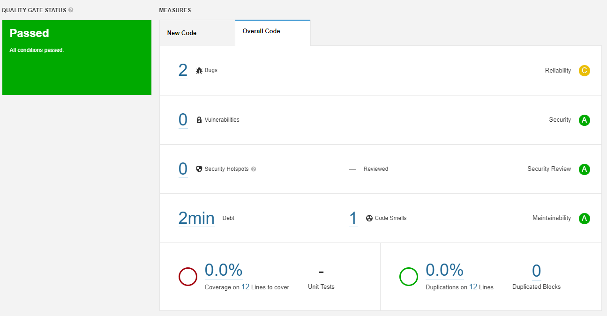
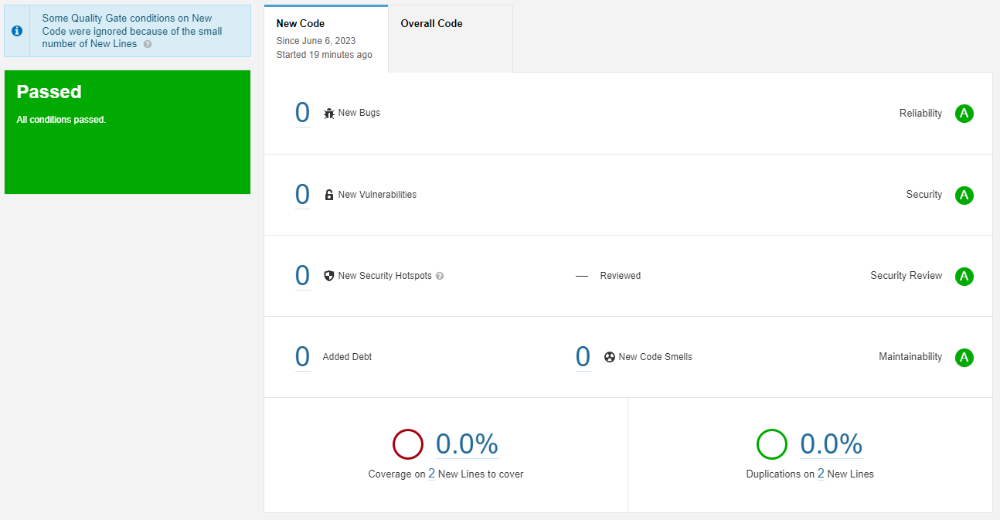

# Домашнее задание к занятию 9 «Процессы CI/CD»

## Подготовка к выполнению

1. Создайте два VM в Yandex Cloud с параметрами: 2CPU 4RAM Centos7 (остальное по минимальным требованиям).
2. Пропишите в [inventory](./infrastructure/inventory/cicd/hosts.yml) [playbook](./infrastructure/site.yml) созданные хосты.
3. Добавьте в [files](./infrastructure/files/) файл со своим публичным ключом (id_rsa.pub). Если ключ называется иначе — найдите таску в плейбуке, которая использует id_rsa.pub имя, и исправьте на своё.
4. Запустите playbook, ожидайте успешного завершения.
5. Проверьте готовность SonarQube через [браузер](http://localhost:9000).
6. Зайдите под admin\admin, поменяйте пароль на свой.
7.  Проверьте готовность Nexus через [бразуер](http://localhost:8081).
8. Подключитесь под admin\admin123, поменяйте пароль, сохраните анонимный доступ.

## Знакомоство с SonarQube

### Основная часть

1. Создайте новый проект, название произвольное.
2. Скачайте пакет sonar-scanner, который вам предлагает скачать SonarQube.
3. Сделайте так, чтобы binary был доступен через вызов в shell (или поменяйте переменную PATH, или любой другой, удобный вам способ).
4. Проверьте `sonar-scanner --version`.

```shell
nrv@nrv:~/devops-netology/homeworks/09-ci-03-cicd$ sonar-scanner --version
INFO: Scanner configuration file: /home/nrv/temporary/sonar-scanner-4.8.0.2856-linux/conf/sonar-scanner.properties
INFO: Project root configuration file: NONE
INFO: SonarScanner 4.8.0.2856
INFO: Java 11.0.17 Eclipse Adoptium (64-bit)
INFO: Linux 5.15.90.1-microsoft-standard-WSL2 amd64
nrv@nrv:~/devops-netology/homeworks/09-ci-03-cicd
```
5. Запустите анализатор против кода из директории [example](./example) с дополнительным ключом `-Dsonar.coverage.exclusions=fail.py`.

<details><summary>Output</summary>

```shell
nrv@nrv:~/devops-netology/homeworks/09-ci-03-cicd/example$ sonar-scanner   -Dsonar.projectKey=nrv1   -Dsonar.sources=.   -Dsonar.host.url=http://158.160.111.155:9000   -Dsonar.login=5360e338cb0baca6a132bdfeb31b05708a603106 -Dsonar..coverage.exclusions=fail.py
INFO: Scanner configuration file: /home/nrv/temporary/sonar-scanner-4.8.0.2856-linux/conf/sonar-scanner.properties
INFO: Project root configuration file: NONE
INFO: SonarScanner 4.8.0.2856
INFO: Java 11.0.17 Eclipse Adoptium (64-bit)
INFO: Linux 5.15.90.1-microsoft-standard-WSL2 amd64
INFO: User cache: /home/nrv/.sonar/cache
INFO: Analyzing on SonarQube server 9.1.0
INFO: Default locale: "en", source code encoding: "UTF-8" (analysis is platform dependent)
INFO: Load global settings
INFO: Load global settings (done) | time=129ms
INFO: Server id: 9CFC3560-AYiQKUKCeNVmBcl50Re6
INFO: User cache: /home/nrv/.sonar/cache
INFO: Load/download plugins
INFO: Load plugins index
INFO: Load plugins index (done) | time=65ms
INFO: Load/download plugins (done) | time=16899ms
INFO: Process project properties
INFO: Process project properties (done) | time=9ms
INFO: Execute project builders
INFO: Execute project builders (done) | time=2ms
INFO: Project key: nrv1
INFO: Base dir: /home/nrv/devops-netology/homeworks/09-ci-03-cicd/example
INFO: Working dir: /home/nrv/devops-netology/homeworks/09-ci-03-cicd/example/.scannerwork
INFO: Load project settings for component key: 'nrv1'
INFO: Load project settings for component key: 'nrv1' (done) | time=53ms
INFO: Load quality profiles
INFO: Load quality profiles (done) | time=124ms
INFO: Load active rules
INFO: Load active rules (done) | time=2120ms
INFO: Indexing files...
INFO: Project configuration:
INFO: 1 file indexed
INFO: 0 files ignored because of scm ignore settings
INFO: Quality profile for py: Sonar way
INFO: ------------- Run sensors on module nrv1
INFO: Load metrics repository
INFO: Load metrics repository (done) | time=56ms
INFO: Sensor Python Sensor [python]
WARN: Your code is analyzed as compatible with python 2 and 3 by default. This will prevent the detection of issues specific to python 2 or python 3. You can get a more precise analysis by setting a python version in your configuration via the parameter "sonar.python.version"
INFO: Starting global symbols computation
INFO: 1 source file to be analyzed
INFO: Load project repositories
INFO: Load project repositories (done) | time=52ms
INFO: 1/1 source file has been analyzed
INFO: Starting rules execution
INFO: 1 source file to be analyzed
INFO: 1/1 source file has been analyzed
INFO: Sensor Python Sensor [python] (done) | time=859ms
INFO: Sensor Cobertura Sensor for Python coverage [python]
INFO: Sensor Cobertura Sensor for Python coverage [python] (done) | time=7ms
INFO: Sensor PythonXUnitSensor [python]
INFO: Sensor PythonXUnitSensor [python] (done) | time=1ms
INFO: Sensor CSS Rules [cssfamily]
INFO: No CSS, PHP, HTML or VueJS files are found in the project. CSS analysis is skipped.
INFO: Sensor CSS Rules [cssfamily] (done) | time=0ms
INFO: Sensor JaCoCo XML Report Importer [jacoco]
INFO: 'sonar.coverage.jacoco.xmlReportPaths' is not defined. Using default locations: target/site/jacoco/jacoco.xml,target/site/jacoco-it/jacoco.xml,build/reports/jacoco/test/jacocoTestReport.xml
INFO: No report imported, no coverage information will be imported by JaCoCo XML Report Importer
INFO: Sensor JaCoCo XML Report Importer [jacoco] (done) | time=2ms
INFO: Sensor C# Project Type Information [csharp]
INFO: Sensor C# Project Type Information [csharp] (done) | time=1ms
INFO: Sensor C# Analysis Log [csharp]
INFO: Sensor C# Analysis Log [csharp] (done) | time=9ms
INFO: Sensor C# Properties [csharp]
INFO: Sensor C# Properties [csharp] (done) | time=0ms
INFO: Sensor JavaXmlSensor [java]
INFO: Sensor JavaXmlSensor [java] (done) | time=1ms
INFO: Sensor HTML [web]
INFO: Sensor HTML [web] (done) | time=3ms
INFO: Sensor VB.NET Project Type Information [vbnet]
INFO: Sensor VB.NET Project Type Information [vbnet] (done) | time=1ms
INFO: Sensor VB.NET Analysis Log [vbnet]
INFO: Sensor VB.NET Analysis Log [vbnet] (done) | time=12ms
INFO: Sensor VB.NET Properties [vbnet]
INFO: Sensor VB.NET Properties [vbnet] (done) | time=0ms
INFO: ------------- Run sensors on project
INFO: Sensor Zero Coverage Sensor
INFO: Sensor Zero Coverage Sensor (done) | time=8ms
INFO: SCM Publisher SCM provider for this project is: git
INFO: SCM Publisher 1 source file to be analyzed
INFO: SCM Publisher 0/1 source files have been analyzed (done) | time=69ms
WARN: Missing blame information for the following files:
WARN:   * fail.py
WARN: This may lead to missing/broken features in SonarQube
INFO: CPD Executor Calculating CPD for 1 file
INFO: CPD Executor CPD calculation finished (done) | time=7ms
INFO: Analysis report generated in 54ms, dir size=103.3 kB
INFO: Analysis report compressed in 8ms, zip size=14.4 kB
INFO: Analysis report uploaded in 70ms
INFO: ANALYSIS SUCCESSFUL, you can browse http://158.160.111.155:9000/dashboard?id=nrv1
INFO: Note that you will be able to access the updated dashboard once the server has processed the submitted analysis report
INFO: More about the report processing at http://158.160.111.155:9000/api/ce/task?id=AYiQfU7veNVmBcl50WkF
INFO: Analysis total time: 5.403 s
INFO: ------------------------------------------------------------------------
INFO: EXECUTION SUCCESS
INFO: ------------------------------------------------------------------------
INFO: Total time: 23.135s
INFO: Final Memory: 8M/30M
INFO: ------------------------------------------------------------------------
nrv@nrv:~/devops-netology/homeworks/09-ci-03-cicd/example$
```
</details>

6. Посмотрите результат в интерфейсе.



7. Исправьте ошибки, которые он выявил, включая warnings.
8. Запустите анализатор повторно — проверьте, что QG пройдены успешно.



9. Сделайте скриншот успешного прохождения анализа, приложите к решению ДЗ.

## Знакомство с Nexus

### Основная часть

1. В репозиторий `maven-public` загрузите артефакт с GAV-параметрами:

 *    groupId: netology;
 *    artifactId: java;
 *    version: 8_282;
 *    classifier: distrib;
 *    type: tar.gz.
   
2. В него же загрузите такой же артефакт, но с version: 8_102.
3. Проверьте, что все файлы загрузились успешно.
4. В ответе пришлите файл `maven-metadata.xml` для этого артефекта.

[maven-metadata.xml](files/maven-metadata.xml)

### Знакомство с Maven

### Подготовка к выполнению

1. Скачайте дистрибутив с [maven](https://maven.apache.org/download.cgi).
2. Разархивируйте, сделайте так, чтобы binary был доступен через вызов в shell (или поменяйте переменную PATH, или любой другой, удобный вам способ).
3. Удалите из `apache-maven-<version>/conf/settings.xml` упоминание о правиле, отвергающем HTTP- соединение — раздел mirrors —> id: my-repository-http-unblocker.
4. Проверьте `mvn --version`.
5. Заберите директорию [mvn](./mvn) с pom.

### Основная часть

1. Поменяйте в `pom.xml` блок с зависимостями под ваш артефакт из первого пункта задания для Nexus (java с версией 8_282).
2. Запустите команду `mvn package` в директории с `pom.xml`, ожидайте успешного окончания.
3. Проверьте директорию `~/.m2/repository/`, найдите ваш артефакт.

```shell
nrv@nrv:~$ ls ~/.m2/repository/netology/java/8_103
_remote.repositories    java-8_103-distrib.jar.sha1            java-8_103.pom
java-8_103-distrib.jar  java-8_103-distrib.tar.gz.lastUpdated  java-8_103.pom.sha1
nrv@nrv:~$
```

4. В ответе пришлите исправленный файл `pom.xml`.

[pom.xml](mvn/pom.xml)

---

### Как оформить решение задания

Выполненное домашнее задание пришлите в виде ссылки на .md-файл в вашем репозитории.

---
