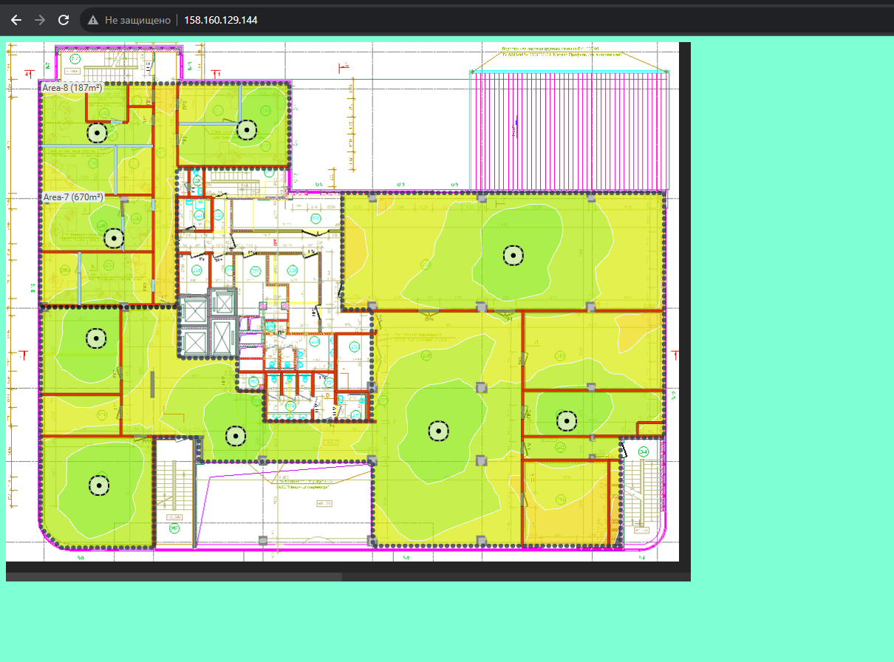

# Домашнее задание к занятию «Вычислительные мощности. Балансировщики нагрузки»  

### Подготовка к выполнению задания

1. Домашнее задание состоит из обязательной части, которую нужно выполнить на провайдере Yandex Cloud, и дополнительной части в AWS (выполняется по желанию). 
2. Все домашние задания в блоке 15 связаны друг с другом и в конце представляют пример законченной инфраструктуры.  
3. Все задания нужно выполнить с помощью Terraform. Результатом выполненного домашнего задания будет код в репозитории. 
4. Перед началом работы настройте доступ к облачным ресурсам из Terraform, используя материалы прошлых лекций и домашних заданий.

---
## Задание 1. Yandex Cloud 

**Что нужно сделать**

1. Создать бакет Object Storage и разместить в нём файл с картинкой:

 - Создать бакет в Object Storage с произвольным именем (например, _имя_студента_дата_).
 - Положить в бакет файл с картинкой.
 - Сделать файл доступным из интернета.
 
2. Создать группу ВМ в public подсети фиксированного размера с шаблоном LAMP и веб-страницей, содержащей ссылку на картинку из бакета:

 - Создать Instance Group с тремя ВМ и шаблоном LAMP. Для LAMP рекомендуется использовать `image_id = fd827b91d99psvq5fjit`.
 - Для создания стартовой веб-страницы рекомендуется использовать раздел `user_data` в [meta_data](https://cloud.yandex.ru/docs/compute/concepts/vm-metadata).
 - Разместить в стартовой веб-странице шаблонной ВМ ссылку на картинку из бакета.
 - Настроить проверку состояния ВМ.
 
3. Подключить группу к сетевому балансировщику:

 - Создать сетевой балансировщик.
 - Проверить работоспособность, удалив одну или несколько ВМ.
4. (дополнительно)* Создать Application Load Balancer с использованием Instance group и проверкой состояния.

Полезные документы:

- [Compute instance group](https://registry.terraform.io/providers/yandex-cloud/yandex/latest/docs/resources/compute_instance_group).
- [Network Load Balancer](https://registry.terraform.io/providers/yandex-cloud/yandex/latest/docs/resources/lb_network_load_balancer).
- [Группа ВМ с сетевым балансировщиком](https://cloud.yandex.ru/docs/compute/operations/instance-groups/create-with-balancer).

## Решение задание 1.

### [Terraform code](terraform/)

<details><summary>Создать бакет Object Storage и разместить в нём файл с картинкой</summary>

```shell
nrv@nrv:~/devops-netology/homeworks/clopro-2/terraform$ yc storage bucket list
+------------+----------------------+-----------+-----------------------+---------------------+
|    NAME    |      FOLDER ID       | MAX SIZE  | DEFAULT STORAGE CLASS |     CREATED AT      |
+------------+----------------------+-----------+-----------------------+---------------------+
| nrv-test-1 | b1gkuhr7ssi0qfamt3uq | 104857600 | STANDARD              | 2023-12-05 13:07:54 |
+------------+----------------------+-----------+-----------------------+---------------------+
nrv@nrv:~/devops-netology/homeworks/clopro-2/terraform$ yc storage bucket stats nrv-test-1
name: nrv-test-1
max_size: "104857600"
used_size: "256395"
storage_class_used_sizes:
  - storage_class: STANDARD
    class_size: "256395"
storage_class_counters:
  - storage_class: STANDARD
    counters:
      simple_object_size: "256395"
      simple_object_count: "1"
default_storage_class: STANDARD
anonymous_access_flags:
  read: true
  list: false
  config_read: true
created_at: "2023-12-05T13:07:54.099706Z"
updated_at: "2023-12-05T13:13:49.546182Z"
nrv@nrv:~/devops-netology/homeworks/clopro-2/terraform$ curl -S -I https://storage.yandexcloud.net/nrv-test-1/test-pic.p
ng
HTTP/2 200
server: nginx
date: Tue, 05 Dec 2023 13:34:06 GMT
content-type: application/octet-stream
content-length: 256395
accept-ranges: bytes
etag: "ccb29bb4170956960fe794402925fbe6"
last-modified: Tue, 05 Dec 2023 13:09:00 GMT
x-amz-request-id: b533082897814b7b
```
</details>

---

<details><summary>Создать группу ВМ в public подсети фиксированного размера с шаблоном LAMP и веб-страницей, содержащей ссылку на картинку из бакета</summary>

```shell
nrv@nrv:~/devops-netology/homeworks/clopro-2/terraform$ yc compute instance-group list
+----------------------+------+--------+------+
|          ID          | NAME | STATUS | SIZE |
+----------------------+------+--------+------+
| cl1j6nd06mpsnc9qut2s | ig-1 | ACTIVE |    3 |
+----------------------+------+--------+------+
nrv@nrv:~/devops-netology/homeworks/clopro-2/terraform$ yc compute instance-group list-instances --name ig-1
+----------------------+---------------------------+-------------+---------------+----------------------+----------------+
|     INSTANCE ID      |           NAME            | EXTERNAL IP |  INTERNAL IP  |        STATUS        | STATUS MESSAGE |
+----------------------+---------------------------+-------------+---------------+----------------------+----------------+
| fhm55s14ovgfabufn876 | cl1j6nd06mpsnc9qut2s-ebog |             | 192.168.10.8  | RUNNING_ACTUAL [34m] |                |
| fhmuvohv14o7qgn3g08q | cl1j6nd06mpsnc9qut2s-iwir |             | 192.168.10.27 | RUNNING_ACTUAL [33m] |                |
| fhm71j9rekv5t51131eu | cl1j6nd06mpsnc9qut2s-ozet |             | 192.168.10.9  | RUNNING_ACTUAL [34m] |                |
+----------------------+---------------------------+-------------+---------------+----------------------+----------------+
yc compute instance-group get --name ig-1
id: cl1j6nd06mpsnc9qut2s
folder_id: b1gkuhr7ssi0qfamt3uq
created_at: "2023-12-05T13:09:01.748Z"
name: ig-1
instance_template:
  platform_id: standard-v3
  resources_spec:
    memory: "2147483648"
    cores: "2"
    core_fraction: "20"
  boot_disk_spec:
    mode: READ_WRITE
    disk_spec:
      type_id: network-hdd
      size: "16106127360"
      image_id: fd8gnvkksobme3786ljc
  network_interface_specs:
    - network_id: enp84ptkmkncu45q53bh
      subnet_ids:
        - e9brc7csjkaap5nji10f
      primary_v4_address_spec: {}
  scheduling_policy:
    preemptible: true
scale_policy:
  fixed_scale:
    size: "3"
deploy_policy:
  max_unavailable: "1"
  strategy: PROACTIVE
allocation_policy:
  zones:
    - zone_id: ru-central1-a
load_balancer_state:
  target_group_id: enpmka31m454e4sgg56d
managed_instances_state:
  target_size: "3"
  running_actual_count: "3"
load_balancer_spec:
  target_group_spec:
    name: target-group
    description: load balancer target group
service_account_id: ajeq9k9fbgh1b6iiihvc
status: ACTIVE
application_load_balancer_state: {}
```
</details>

---

<details><summary>Подключить группу к сетевому балансировщику</summary>

```shell
nrv@nrv:~/devops-netology/homeworks/clopro-2/terraform$ yc load-balancer network-load-balancer list
+----------------------+-------------------------+-------------+----------+----------------+------------------------+--------+
|          ID          |          NAME           |  REGION ID  |   TYPE   | LISTENER COUNT | ATTACHED TARGET GROUPS | STATUS |
+----------------------+-------------------------+-------------+----------+----------------+------------------------+--------+
| enphqult0pb6jd5pt4t5 | network-load-balancer-1 | ru-central1 | EXTERNAL |              1 | enpmka31m454e4sgg56d   | ACTIVE |
+----------------------+-------------------------+-------------+----------+----------------+------------------------+--------+
nrv@nrv:~/devops-netology/homeworks/clopro-2/terraform$ yc load-balancer network-load-balancer get enphqult0pb6jd5pt4t5
id: enphqult0pb6jd5pt4t5
folder_id: b1gkuhr7ssi0qfamt3uq
created_at: "2023-12-05T13:10:08Z"
name: network-load-balancer-1
region_id: ru-central1
status: ACTIVE
type: EXTERNAL
listeners:
  - name: network-load-balancer-1-listener
    address: 158.160.129.144
    port: "80"
    protocol: TCP
    target_port: "80"
    ip_version: IPV4
attached_target_groups:
  - target_group_id: enpmka31m454e4sgg56d
    health_checks:
      - name: http
        interval: 2s
        timeout: 1s
        unhealthy_threshold: "2"
        healthy_threshold: "2"
        http_options:
          port: "80"
          path: /index.html
```



</details>


---
## Задание 2*. AWS (задание со звёздочкой)

Это необязательное задание. Его выполнение не влияет на получение зачёта по домашней работе.

**Что нужно сделать**

Используя конфигурации, выполненные в домашнем задании из предыдущего занятия, добавить к Production like сети Autoscaling group из трёх EC2-инстансов с  автоматической установкой веб-сервера в private домен.

1. Создать бакет S3 и разместить в нём файл с картинкой:

 - Создать бакет в S3 с произвольным именем (например, _имя_студента_дата_).
 - Положить в бакет файл с картинкой.
 - Сделать доступным из интернета.
2. Сделать Launch configurations с использованием bootstrap-скрипта с созданием веб-страницы, на которой будет ссылка на картинку в S3. 
3. Загрузить три ЕС2-инстанса и настроить LB с помощью Autoscaling Group.

Resource Terraform:

- [S3 bucket](https://registry.terraform.io/providers/hashicorp/aws/latest/docs/resources/s3_bucket)
- [Launch Template](https://registry.terraform.io/providers/hashicorp/aws/latest/docs/resources/launch_template).
- [Autoscaling group](https://registry.terraform.io/providers/hashicorp/aws/latest/docs/resources/autoscaling_group).
- [Launch configuration](https://registry.terraform.io/providers/hashicorp/aws/latest/docs/resources/launch_configuration).

Пример bootstrap-скрипта:

```
#!/bin/bash
yum install httpd -y
service httpd start
chkconfig httpd on
cd /var/www/html
echo "<html><h1>My cool web-server</h1></html>" > index.html
```
### Правила приёма работы

Домашняя работа оформляется в своём Git репозитории в файле README.md. Выполненное домашнее задание пришлите ссылкой на .md-файл в вашем репозитории.
Файл README.md должен содержать скриншоты вывода необходимых команд, а также скриншоты результатов.
Репозиторий должен содержать тексты манифестов или ссылки на них в файле README.md.
