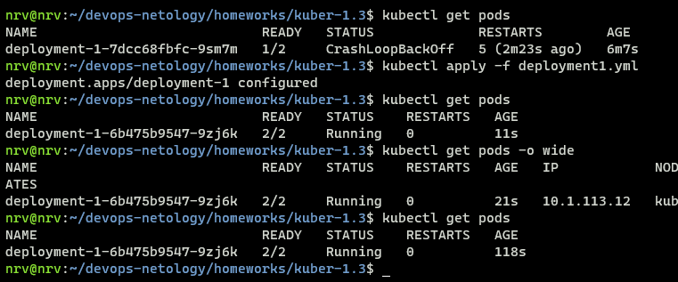

# Домашнее задание к занятию «Запуск приложений в K8S»

### Цель задания

В тестовой среде для работы с Kubernetes, установленной в предыдущем ДЗ, необходимо развернуть Deployment с приложением, состоящим из нескольких контейнеров, и масштабировать его.

------

### Чеклист готовности к домашнему заданию

1. Установленное k8s-решение (например, MicroK8S).
2. Установленный локальный kubectl.
3. Редактор YAML-файлов с подключённым git-репозиторием.

------

### Инструменты и дополнительные материалы, которые пригодятся для выполнения задания

1. [Описание](https://kubernetes.io/docs/concepts/workloads/controllers/deployment/) Deployment и примеры манифестов.
2. [Описание](https://kubernetes.io/docs/concepts/workloads/pods/init-containers/) Init-контейнеров.
3. [Описание](https://github.com/wbitt/Network-MultiTool) Multitool.

------

### Задание 1. Создать Deployment и обеспечить доступ к репликам приложения из другого Pod

1. Создать Deployment приложения, состоящего из двух контейнеров — nginx и multitool. Решить возникшую ошибку.

[deployment1.yml](deployment1.yml)



2. После запуска увеличить количество реплик работающего приложения до 2.
3. Продемонстрировать количество подов до и после масштабирования.


4. Создать Service, который обеспечит доступ до реплик приложений из п.1.


5. Создать отдельный Pod с приложением multitool и убедиться с помощью `curl`, что из пода есть доступ до приложений из п.1.


<details><summary>Результат</summary>

```shell
nrv@nrv:~/devops-netology/homeworks/kuber-1.3$ kubectl get pods -o wide
NAME                            READY   STATUS    RESTARTS   AGE    IP            NODE       NOMINATED NODE   READINESS GATESmultitool-test-pod              1/1     Running   0          15m    10.1.113.14   kuber-vm   <none>           <none>
deployment-1-54f6f889f5-k4n8p   2/2     Running   0          105s   10.1.113.15   kuber-vm   <none>           <none>
deployment-1-54f6f889f5-pcxkk   2/2     Running   0          101s   10.1.113.16   kuber-vm   <none>           <none>
nrv@nrv:~/devops-netology/homeworks/kuber-1.3$ kubectl exec multitool-test-pod -- curl -s service-test:80
<!DOCTYPE html>
<html>
<head>
<title>Welcome to nginx!</title>
<style>
html { color-scheme: light dark; }
body { width: 35em; margin: 0 auto;
font-family: Tahoma, Verdana, Arial, sans-serif; }
</style>
</head>
<body>
<h1>Welcome to nginx!</h1>
<p>If you see this page, the nginx web server is successfully installed and
working. Further configuration is required.</p>

<p>For online documentation and support please refer to
<a href="http://nginx.org/">nginx.org</a>.<br/>
Commercial support is available at
<a href="http://nginx.com/">nginx.com</a>.</p>

<p><em>Thank you for using nginx.</em></p>
</body>
</html>
nrv@nrv:~/devops-netology/homeworks/kuber-1.3$ kubectl exec multitool-test-pod -- curl -s service-test:1180
WBITT Network MultiTool (with NGINX) - deployment-1-54f6f889f5-pcxkk - 10.1.113.16 - HTTP: 1180 , HTTPS: 11443 . (Formerly praqma/network-multitool)
nrv@nrv:~/devops-netology/homeworks/kuber-1.3$ kubectl exec multitool-test-pod -- curl -s service-test:11443
<html>
<head><title>400 The plain HTTP request was sent to HTTPS port</title></head>
<body>
<center><h1>400 Bad Request</h1></center>
<center>The plain HTTP request was sent to HTTPS port</center>
<hr><center>nginx/1.24.0</center>
</body>
</html>
nrv@nrv:~/devops-netology/homeworks/kuber-1.3
```
</details>

------

### Задание 2. Создать Deployment и обеспечить старт основного контейнера при выполнении условий

1. Создать Deployment приложения nginx и обеспечить старт контейнера только после того, как будет запущен сервис этого приложения.
2. Убедиться, что nginx не стартует. В качестве Init-контейнера взять busybox.
3. Создать и запустить Service. Убедиться, что Init запустился.
4. Продемонстрировать состояние пода до и после запуска сервиса.

[deployment2.yml](deployment2.yml)


------

### Правила приема работы

1. Домашняя работа оформляется в своем Git-репозитории в файле README.md. Выполненное домашнее задание пришлите ссылкой на .md-файл в вашем репозитории.
2. Файл README.md должен содержать скриншоты вывода необходимых команд `kubectl` и скриншоты результатов.
3. Репозиторий должен содержать файлы манифестов и ссылки на них в файле README.md.

------
