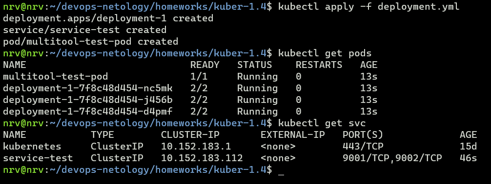

# Домашнее задание к занятию «Сетевое взаимодействие в K8S. Часть 1»

### Цель задания

В тестовой среде Kubernetes необходимо обеспечить доступ к приложению, установленному в предыдущем ДЗ и состоящему из двух контейнеров, по разным портам в разные контейнеры как внутри кластера, так и снаружи.

------

### Чеклист готовности к домашнему заданию

1. Установленное k8s-решение (например, MicroK8S).
2. Установленный локальный kubectl.
3. Редактор YAML-файлов с подключённым Git-репозиторием.

------

### Инструменты и дополнительные материалы, которые пригодятся для выполнения задания

1. [Описание](https://kubernetes.io/docs/concepts/workloads/controllers/deployment/) Deployment и примеры манифестов.
2. [Описание](https://kubernetes.io/docs/concepts/services-networking/service/) Описание Service.
3. [Описание](https://github.com/wbitt/Network-MultiTool) Multitool.

------

### Задание 1. Создать Deployment и обеспечить доступ к контейнерам приложения по разным портам из другого Pod внутри кластера

1. Создать Deployment приложения, состоящего из двух контейнеров (nginx и multitool), с количеством реплик 3 шт.
2. Создать Service, который обеспечит доступ внутри кластера до контейнеров приложения из п.1 по порту 9001 — nginx 80, по 9002 — multitool 8080.


[deployment.yml](deployment.yml)



3. Создать отдельный Pod с приложением multitool и убедиться с помощью `curl`, что из пода есть доступ до приложения из п.1 по разным портам в разные контейнеры.

<details>
<summary>Листинг вывода команд</summary>

```shell
nrv@nrv:~/devops-netology/homeworks/kuber-1.4$ kubectl get pods -o wide
NAME                            READY   STATUS    RESTARTS   AGE   IP            NODE       NOMINATED NODE   READINESS GATES
multitool-test-pod              1/1     Running   0          15m   10.1.113.27   kuber-vm   <none>           <none>
deployment-1-7f8c48d454-nc5mk   2/2     Running   0          15m   10.1.113.24   kuber-vm   <none>           <none>
deployment-1-7f8c48d454-j456b   2/2     Running   0          15m   10.1.113.25   kuber-vm   <none>           <none>
deployment-1-7f8c48d454-d4pmf   2/2     Running   0          15m   10.1.113.26   kuber-vm   <none>           <none>
nrv@nrv:~/devops-netology/homeworks/kuber-1.4$ kubectl exec multitool-test-pod -- curl -s 10.1.113.24:8080
WBITT Network MultiTool (with NGINX) - deployment-1-7f8c48d454-nc5mk - 10.1.113.24 - HTTP: 8080 , HTTPS: 443 . (Formerly praqma/network-multitool)
nrv@nrv:~/devops-netology/homeworks/kuber-1.4$ kubectl exec multitool-test-pod -- curl -s 10.1.113.25:8080
WBITT Network MultiTool (with NGINX) - deployment-1-7f8c48d454-j456b - 10.1.113.25 - HTTP: 8080 , HTTPS: 443 . (Formerly praqma/network-multitool)
nrv@nrv:~/devops-netology/homeworks/kuber-1.4$ kubectl exec multitool-test-pod -- curl -s 10.1.113.26:8080
WBITT Network MultiTool (with NGINX) - deployment-1-7f8c48d454-d4pmf - 10.1.113.26 - HTTP: 8080 , HTTPS: 443 . (Formerly praqma/network-multitool)
nrv@nrv:~/devops-netology/homeworks/kuber-1.4$ kubectl exec multitool-test-pod -- curl -s 10.1.113.24:80
<!DOCTYPE html>
<html>
<head>
<title>Welcome to nginx!</title>
<style>
html { color-scheme: light dark; }
body { width: 35em; margin: 0 auto;
font-family: Tahoma, Verdana, Arial, sans-serif; }
</style>
</head>
<body>
<h1>Welcome to nginx!</h1>
<p>If you see this page, the nginx web server is successfully installed and
working. Further configuration is required.</p>

<p>For online documentation and support please refer to
<a href="http://nginx.org/">nginx.org</a>.<br/>
Commercial support is available at
<a href="http://nginx.com/">nginx.com</a>.</p>

<p><em>Thank you for using nginx.</em></p>
</body>
</html>
nrv@nrv:~/devops-netology/homeworks/kuber-1.4$ kubectl exec multitool-test-pod -- curl -s 10.1.113.25:80
<!DOCTYPE html>
<html>
<head>
<title>Welcome to nginx!</title>
<style>
html { color-scheme: light dark; }
body { width: 35em; margin: 0 auto;
font-family: Tahoma, Verdana, Arial, sans-serif; }
</style>
</head>
<body>
<h1>Welcome to nginx!</h1>
<p>If you see this page, the nginx web server is successfully installed and
working. Further configuration is required.</p>

<p>For online documentation and support please refer to
<a href="http://nginx.org/">nginx.org</a>.<br/>
Commercial support is available at
<a href="http://nginx.com/">nginx.com</a>.</p>

<p><em>Thank you for using nginx.</em></p>
</body>
</html>
nrv@nrv:~/devops-netology/homeworks/kuber-1.4$ kubectl exec multitool-test-pod -- curl -s 10.1.113.26:80
<!DOCTYPE html>
<html>
<head>
<title>Welcome to nginx!</title>
<style>
html { color-scheme: light dark; }
body { width: 35em; margin: 0 auto;
font-family: Tahoma, Verdana, Arial, sans-serif; }
</style>
</head>
<body>
<h1>Welcome to nginx!</h1>
<p>If you see this page, the nginx web server is successfully installed and
working. Further configuration is required.</p>

<p>For online documentation and support please refer to
<a href="http://nginx.org/">nginx.org</a>.<br/>
Commercial support is available at
<a href="http://nginx.com/">nginx.com</a>.</p>

<p><em>Thank you for using nginx.</em></p>
</body>
</html>
nrv@nrv:~/devops-netology/homeworks/kuber-1.4$
```
</details>

4. Продемонстрировать доступ с помощью `curl` по доменному имени сервиса.

<details>
<summary>Листинг вывода команд</summary>

```shell
nrv@nrv:~/devops-netology/homeworks/kuber-1.4$ kubectl describe svc service-test
Name:              service-test
Namespace:         default
Labels:            <none>
Annotations:       <none>
Selector:          app=nginx
Type:              ClusterIP
IP Family Policy:  SingleStack
IP Families:       IPv4
IP:                10.152.183.112
IPs:               10.152.183.112
Port:              service-nginx-http  9001/TCP
TargetPort:        nginx-http/TCP
Endpoints:         10.1.113.24:80,10.1.113.25:80,10.1.113.26:80
Port:              service-multitool-http  9002/TCP
TargetPort:        mtool-http/TCP
Endpoints:         10.1.113.24:8080,10.1.113.25:8080,10.1.113.26:8080
Session Affinity:  None
Events:            <none>
nrv@nrv:~/devops-netology/homeworks/kuber-1.4$ kubectl exec multitool-test-pod -- curl -s service-test:9001
<!DOCTYPE html>
<html>
<head>
<title>Welcome to nginx!</title>
<style>
html { color-scheme: light dark; }
body { width: 35em; margin: 0 auto;
font-family: Tahoma, Verdana, Arial, sans-serif; }
</style>
</head>
<body>
<h1>Welcome to nginx!</h1>
<p>If you see this page, the nginx web server is successfully installed and
working. Further configuration is required.</p>

<p>For online documentation and support please refer to
<a href="http://nginx.org/">nginx.org</a>.<br/>
Commercial support is available at
<a href="http://nginx.com/">nginx.com</a>.</p>

<p><em>Thank you for using nginx.</em></p>
</body>
</html>
nrv@nrv:~/devops-netology/homeworks/kuber-1.4$ kubectl exec multitool-test-pod -- curl -s service-test:9002
WBITT Network MultiTool (with NGINX) - deployment-1-7f8c48d454-j456b - 10.1.113.25 - HTTP: 8080 , HTTPS: 443 . (Formerly praqma/network-multitool)
nrv@nrv:~/devops-netology/homeworks/kuber-1.4$ kubectl exec multitool-test-pod -- curl -s service-test.default.svc.cluste
r.local:9001
<!DOCTYPE html>
<html>
<head>
<title>Welcome to nginx!</title>
<style>
html { color-scheme: light dark; }
body { width: 35em; margin: 0 auto;
font-family: Tahoma, Verdana, Arial, sans-serif; }
</style>
</head>
<body>
<h1>Welcome to nginx!</h1>
<p>If you see this page, the nginx web server is successfully installed and
working. Further configuration is required.</p>

<p>For online documentation and support please refer to
<a href="http://nginx.org/">nginx.org</a>.<br/>
Commercial support is available at
<a href="http://nginx.com/">nginx.com</a>.</p>

<p><em>Thank you for using nginx.</em></p>
</body>
</html>
nrv@nrv:~/devops-netology/homeworks/kuber-1.4$ kubectl exec multitool-test-pod -- curl -s service-test.default.svc.cluster.local:9002
WBITT Network MultiTool (with NGINX) - deployment-1-7f8c48d454-d4pmf - 10.1.113.26 - HTTP: 8080 , HTTPS: 443 . (Formerly praqma/network-multitool)
nrv@nrv:~/devops-netology/homeworks/kuber-1.4$
```
</details>

5. Предоставить манифесты Deployment и Service в решении, а также скриншоты или вывод команды п.4.

------
### Задание 2. Создать Service и обеспечить доступ к приложениям снаружи кластера

1. Создать отдельный Service приложения из Задания 1 с возможностью доступа снаружи кластера к nginx, используя тип NodePort.
2. Продемонстрировать доступ с помощью браузера или `curl` с локального компьютера.
3. Предоставить манифест и Service в решении, а также скриншоты или вывод команды п.2.

[nodeport-svc.yml](nodeport-svc.yml)

<details>
<summary>вывод команд</summary>

```shell
nrv@nrv:~/devops-netology/homeworks/kuber-1.4$ kubectl get svc
NAME           TYPE        CLUSTER-IP       EXTERNAL-IP   PORT(S)                         AGE
kubernetes     ClusterIP   10.152.183.1     <none>        443/TCP                         15d
service-test   ClusterIP   10.152.183.112   <none>        9001/TCP,9002/TCP               32m
nodeport-svc   NodePort    10.152.183.129   <none>        9001:30081/TCP,9002:30082/TCP   12s
nrv@nrv:~/devops-netology/homeworks/kuber-1.4$ curl -s 158.160.16.1:300081
nrv@nrv:~/devops-netology/homeworks/kuber-1.4$ curl -s 158.160.16.1:30081
<!DOCTYPE html>
<html>
<head>
<title>Welcome to nginx!</title>
<style>
html { color-scheme: light dark; }
body { width: 35em; margin: 0 auto;
font-family: Tahoma, Verdana, Arial, sans-serif; }
</style>
</head>
<body>
<h1>Welcome to nginx!</h1>
<p>If you see this page, the nginx web server is successfully installed and
working. Further configuration is required.</p>

<p>For online documentation and support please refer to
<a href="http://nginx.org/">nginx.org</a>.<br/>
Commercial support is available at
<a href="http://nginx.com/">nginx.com</a>.</p>

<p><em>Thank you for using nginx.</em></p>
</body>
</html>
nrv@nrv:~/devops-netology/homeworks/kuber-1.4$ curl -s 158.160.16.1:30082
WBITT Network MultiTool (with NGINX) - deployment-1-7f8c48d454-nc5mk - 10.1.113.24 - HTTP: 8080 , HTTPS: 443 . (Formerly praqma/network-multitool)
nrv@nrv:~/devops-netology/homeworks/kuber-1.4$
```
</details>

------

### Правила приёма работы

1. Домашняя работа оформляется в своем Git-репозитории в файле README.md. Выполненное домашнее задание пришлите ссылкой на .md-файл в вашем репозитории.
2. Файл README.md должен содержать скриншоты вывода необходимых команд `kubectl` и скриншоты результатов.
3. Репозиторий должен содержать тексты манифестов или ссылки на них в файле README.md.

